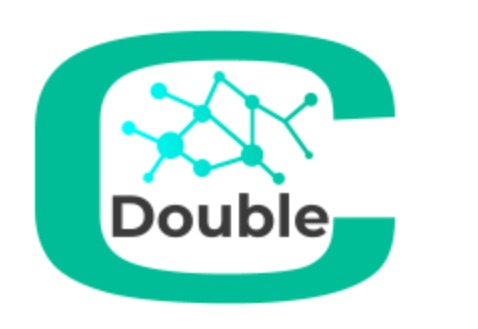
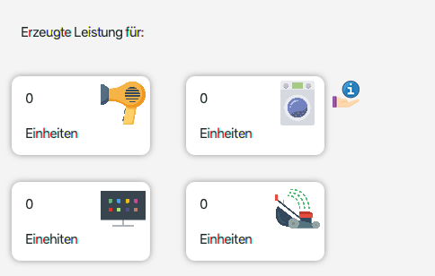
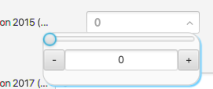

# consumption-converter
  
Custom Control for WindparksFX
Dieser Custom Control bietet eine klare Übersicht, welche Geräte im Haushalt am meisten Strom im Jahr verbrauchen. Unser Converter nimmt den Jahresschnitt von den Geräten und teilt diese durch die erzeugte Enerige von den Windparks.

# Gebrauch

**Package**

Zum zunächst unser Custom Control zu implementieren müssen Sie das consumption-converter Projekt herunterladen. Kopieren Sie den gesamten <code>consumption_converter</code> Ordner und den Ordner mit den Ressourcen.

**UI Converter Dashboard** 

  

Um dieses Custom Control zu brauchen, benötigen Sie die Klasse <code>ConverterControl.java</code> 

**Business control slider** 

  

Um dieses Custom Business Control zu brauchen, benötigen Sie die Klasse <code>SliderControl.java</code> 

# Implementieren

Wählen Sie zunächst welches Custom Control Sie implementieren möchten. (Converter oder Slider)
Danach begeben Sie sich in Ihre gewünschte Klasse wo Sie das UI platzieren möchten.

**Converter Control**
1. Fügen Sie zunächst folgende Deklarationen
<code>private ConverterControl convertercontrol;</code> ein. 

2. Im Bereich <code>private void initializeParts()</code> initialisieren Sie den Converter mit  
<code> convertercontrol = new ConverterControl(); </code>  

3. Nun müssen wir die Bindings anpassen. Ersetzen Sie die herkömmliche <code>textProperty()</code> mit unseren Properties.
Diese können wie gefolgt aussehen.
Beispiel: 
<code>      convertercontrol.firstYearProperty().bindBidirectional(model.getWindparkProxy().production2015MwhProperty()); </code>  
    <code>  convertercontrol.secondYearProperty().bindBidirectional(model.getWindparkProxy().production2016MwhProperty()); </code>
   <code>     convertercontrol.thirdYearProperty().bindBidirectional(model.getWindparkProxy().production2017MwhProperty()); </code>
     <code>   convertercontrol.fourtfhYearProperty().bindBidirectional(model.getWindparkProxy().production2018MwhProperty()); </code>
 
 Unsere Properties stehen für die 4 detailliertenw Jahre.  
 **Produktionsjahr 2015 -> firstYearProperty()  
 Produktionsjahr 2016 -> secondYearProperty() 
 Produktionsjahr 2017 -> thirdYearProperty() 
 Produktionsjahr 2018 -> fourtYearProperty()**  
 
 **Slider Control**
1. Fügen Sie zunächst folgende vier Deklaration  
<code>private SliderControl sliderControl15;</code>  
<code>private SliderControl sliderControl16;</code>  
<code>private SliderControl sliderControl17;</code>  
<code>private SliderControl sliderControl18;</code>ein.  

2. Im Bereich <code>private void initializeParts()</code> initialisieren Sie die Converter mit  
<code> sliderControl15 = new SliderControl(); </code> 
<code> sliderControl16 = new SliderControl(); </code> 
<code> sliderControl17 = new SliderControl(); </code> 
<code> sliderControl18 = new SliderControl(); </code> 

3. Nun müssen wir die Bindings anpassen. Ersetzen Sie die herkömmliche <code>textProperty()</code> mit unseren Properties.
Diese können wie gefolgt aussehen.
Beispiel: 
<code>sliderControl15.valueProperty().bindBidirectional(model.getWindparkProxy().production2015MwhProperty()); </code>  
    <code>  sliderControl16.valueProperty().bindBidirectional(model.getWindparkProxy().production2016MwhProperty());</code>
   <code>     sliderControl17.valueProperty().bindBidirectional(model.getWindparkProxy().production2017MwhProperty());</code>
     <code>   sliderControl18.valueProperty().bindBidirectional(model.getWindparkProxy().production2018MwhProperty()); </code>
 
 Es gibt nur eine Property die für alle Jahre gilt: <code>valueProperty()</code>
 **WICHTIG!**
 entfernen Sie alle <code> new NumberStrinConverter </code>, dieser Fall tritt nicht auf. (wegen unserer valueProperty()) 
 
 
 
 
